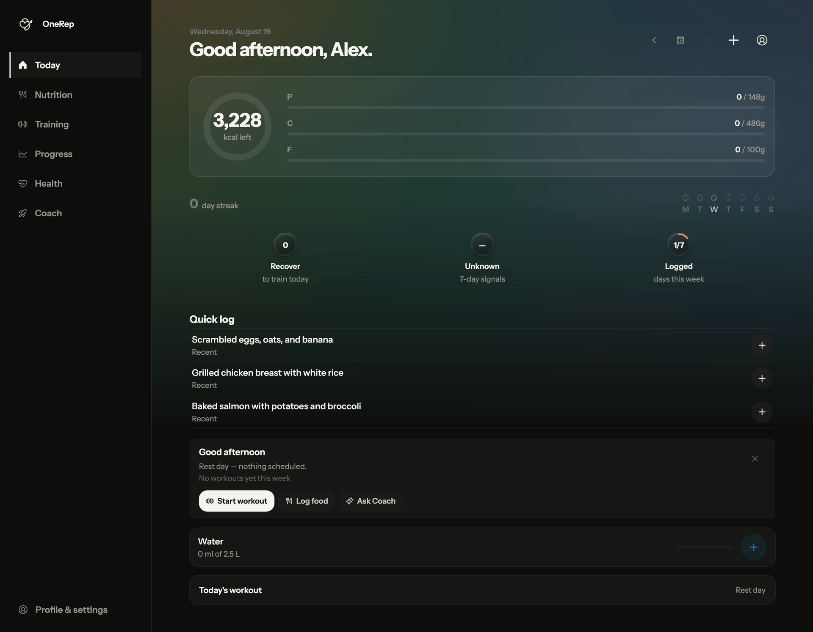

<a id="readme-top"></a>

<!-- PROJECT SHIELDS -->

[![Contributors][contributors-shield]][contributors-url]
[![Forks][forks-shield]][forks-url]
[![Stargazers][stars-shield]][stars-url]
[![Issues][issues-shield]][issues-url]
[![License: PolyForm Noncommercial][license-shield]][license-url]

<!-- PROJECT LOGO -->
<br />
<div align="center">
  <a href="https://app.onerep.life">
    
  </a>

<h3 align="center">OneRep</h3>

  <p align="center">
    Training, nutrition, recovery, and progress in one place, with an AI coach that does the bookkeeping.
    <br />
    <a href="https://docs.onerep.life"><strong>Explore the docs »</strong></a>
    <br />
    <br />
    <a href="https://app.onerep.life">Use the app</a>
    &middot;
    <a href="https://github.com/an2tha/onerep/issues/new?labels=bug">Report Bug</a>
    &middot;
    <a href="https://github.com/an2tha/onerep/issues/new?labels=enhancement">Request Feature</a>
  </p>
</div>

> **Support the project:** OneRep has no investors, no ads, and no plan to acquire either. Development is funded by exactly one thing: [the paid tier on the production app](https://app.onerep.life). If this code is useful to you, a subscription helps more than any number of stars. Stars are also nice.

<!-- TABLE OF CONTENTS -->
<details>
  <summary>Table of Contents</summary>
  <ol>
    <li>
      <a href="#about-the-project">About The Project</a>
      <ul>
        <li><a href="#screenshots">Screenshots</a></li>
        <li><a href="#built-with">Built With</a></li>
        <li><a href="#repository-layout">Repository Layout</a></li>
      </ul>
    </li>
    <li>
      <a href="#getting-started">Getting Started</a>
      <ul>
        <li><a href="#prerequisites">Prerequisites</a></li>
        <li><a href="#install">Install</a></li>
        <li><a href="#load-the-food-database">Load the Food Database</a></li>
        <li><a href="#install-the-ios-and-android-apps">Install the iOS and Android Apps</a></li>
        <li><a href="#optional-integrations">Optional Integrations</a></li>
        <li><a href="#developing-against-your-install">Developing Against Your Install</a></li>
      </ul>
    </li>
    <li><a href="#usage">Usage</a></li>
    <li><a href="#documentation">Documentation</a></li>
    <li><a href="#roadmap">Roadmap</a></li>
    <li><a href="#contributing">Contributing</a></li>
    <li><a href="#license">License</a></li>
    <li><a href="#contact">Contact</a></li>
    <li><a href="#acknowledgments">Acknowledgments</a></li>
  </ol>
</details>

<!-- ABOUT THE PROJECT -->

## About The Project

OneRep is a fitness app that keeps training, nutrition, recovery, and progress in one place. One React codebase ships as a responsive web app, an installable PWA, and Capacitor apps for iOS and Android. Convex handles the database, realtime sync, authentication, scheduled work, and every server-side integration.

The production app lives at [app.onerep.life](https://app.onerep.life).

What's implemented, in the order you'd hit it:

- **Daily dashboard**: calorie and macro targets, meals, water, supplements, scheduled training, Coach goals, configurable widgets.
- **Training**: exercise catalog, workout templates, weekly routines, two concurrent workout slots, rest timers, persisted active workouts, history, volume trends, muscle-recovery estimates.
- **Nutrition**: self-hosted food search across USDA FoodData Central and Open Food Facts, barcode scanning, meal presets, recipes, quick repeat logging, custom macro targets, water and supplement schedules.
- **Progress**: body measurements, body-fat and circumference check-ins, nutrition and training summaries, charts, user-defined metrics.
- **Coach**: text, image, and voice input; personalized briefings; recipes and meal logging; workout and weekly-plan changes; goals, check-ins, memory, and reversible operations. Every AI write carries an undo payload.
- **Photo logging**: food detection with a review step that matches detections to food records before anything is logged.
- **Bring your own key**: paste your own OpenRouter key in Settings and Coach runs on your credential instead of the deployment's. It gets validated against OpenRouter before it saves, stored server-side only, shown as its last four characters, and it's exempt from the monthly allowance, because you're the one paying for the inference.
- **Your data, over the wire**: a [REST API](https://docs.onerep.life/api/overview) and an [MCP endpoint](https://docs.onerep.life/api/mcp/overview) on keys you mint in the app, so your scripts and your assistant read the same log you do.
- **Accounts and privacy**: email/password accounts with verification, analytics opt-in (off by default), full data export, account deletion.

Everything here runs on your own hardware: the Convex backend, the food datasource, and the app itself, brought up by one script. AI, food lookup, email, and analytics each switch on with their own environment variables and stay quiet without them. A deployment without an `OPENROUTER_API_KEY` isn't even AI-less; any user can supply their own key in Settings and Coach works for them alone.

<p align="right">(<a href="#readme-top">back to top</a>)</p>

### Screenshots

A run through the app as it actually looks: the daily dashboard, nutrition,
training, progress, and the Coach.

<div align="center">
  
</div>

<p align="right">(<a href="#readme-top">back to top</a>)</p>

### Built With

- [![Bun][Bun-badge]][Bun-url]
- [![React][React-badge]][React-url]
- [![TypeScript][TS-badge]][TS-url]
- [![Vite][Vite-badge]][Vite-url]
- [![Tailwind CSS][Tailwind-badge]][Tailwind-url]
- [![Convex][Convex-badge]][Convex-url]
- [![Capacitor][Capacitor-badge]][Capacitor-url]
- [![Turborepo][Turbo-badge]][Turbo-url]

<p align="right">(<a href="#readme-top">back to top</a>)</p>

### Repository Layout

```text
.
├── apps/
│   ├── mobile/       # Main React app, PWA, and Capacitor iOS/Android projects
│   └── datasource/   # Self-hosted food + exercise API: USDA, Open Food Facts, wger (Bun + SQLite)
├── convex/           # Schema, auth, queries, mutations, actions, HTTP routes, and crons
├── packages/
│   ├── models/       # Shared TypeScript models and Coach operation contracts
│   └── ui/           # Shared presentation components and Tailwind styles
├── scripts/          # Prompt generation, exercise-catalog prep, mirror publishing
└── selfhost/         # One-command Docker self-hosting: install.sh + docker-compose.yml
```

The mobile app talks directly to Convex; there is no API server in the middle. Secrets stay in the Convex deployment and are never exposed as `VITE_*` variables. `@repo/ui` is the presentation boundary: it renders props and raises callbacks, and does not know Convex exists.

This repository is a one-way mirror of an internal OneDev instance: real commit history, minus the hosted deployment's private bits and the marketing site (`scripts/publish-github.sh` documents exactly which paths and why).

<p align="right">(<a href="#readme-top">back to top</a>)</p>

<!-- GETTING STARTED -->

## Getting Started

### Prerequisites

- Docker with Compose v2. It runs the backend, the dashboard, the datasource, and the app
- [Bun](https://bun.sh/) 1.3.4 or newer on the host (Node.js 18+ also works); the installer needs it to deploy the Convex functions
- Roughly 10 GB of disk for the USDA food database, or ~25 GB if you also import the full Open Food Facts catalog
- Xcode or Android Studio, only if you're doing native work

### Install

```sh
git clone https://github.com/an2tha/onerep.git
cd onerep/selfhost
./install.sh
```

That's the whole installation. The script asks one question (anonymous
telemetry, default yes, and no means no script is built into the app at all),
then writes `selfhost/.env` with generated secrets, brings up the Convex
backend, deploys the functions, sets the deployment's environment variables,
and builds and starts the datasource and the app.

When it finishes it prints your admin key and where things live:

| Service   | URL                     |
| --------- | ----------------------- |
| App       | `http://127.0.0.1:8081` |
| Dashboard | `http://127.0.0.1:6791` |

Re-running is safe: the secrets are kept and the deploy is idempotent. To serve
on a real domain, set `PUBLIC_HOST` before the first run, or edit
`CONVEX_CLOUD_ORIGIN`, `CONVEX_SITE_ORIGIN`, and `APP_URL` in `selfhost/.env`,
put TLS in front of ports 3210/3211/8081, and run `./install.sh` again. Every
knob lives in [`selfhost/docker-compose.yml`](selfhost/docker-compose.yml) and
the comments at the top of [`selfhost/install.sh`](selfhost/install.sh).

Accounts on your install are unlimited and unmetered: no plans, no paywall, no
monthly AI cap. You're the one paying OpenRouter, so nothing meters you.

### Load the Food Database

The datasource starts empty, which means food search finds nothing until you
feed it. Each catalog is independent: import one, two, or all three, and the
service serves whatever is there.

**USDA FoodData Central**: generic whole foods, lab-measured, public domain.
Start here; it is what makes "chicken breast" return an ingredient rather than
a supermarket SKU. From `selfhost/` (~3.1 GB download, a few minutes of
import):

```sh
curl -O https://fdc.nal.usda.gov/fdc-datasets/FoodData_Central_csv_2025-12-18.zip
unzip -q FoodData_Central_csv_2025-12-18.zip -d usda
docker compose cp usda datasource:/tmp/usda
docker compose exec datasource bun src/cli.ts import usda --csv-dir /tmp/usda/FoodData_Central_csv_2025-12-18
docker compose exec datasource rm -rf /tmp/usda
```

**wger**: the exercise catalog, fetched straight from their API, no download
step:

```sh
docker compose exec datasource bun src/cli.ts import wger
```

**Open Food Facts**: packaged products and barcodes, worldwide. This is the
one that makes barcode scanning useful outside the US, and it ships product
photos USDA has none of. The dump is large and the import is the long pole, so
try a slice of it first:

```sh
curl -O https://static.openfoodfacts.org/data/openfoodfacts-products.jsonl.gz
docker compose cp openfoodfacts-products.jsonl.gz datasource:/tmp/off.jsonl.gz

# A partial import, enough to see it working (minutes rather than hours)
docker compose exec datasource bun src/cli.ts import off --file /tmp/off.jsonl.gz --limit 50000

# ...or the whole catalog
docker compose exec datasource bun src/cli.ts import off --file /tmp/off.jsonl.gz
docker compose exec datasource rm -f /tmp/off.jsonl.gz
```

The gzip is read as-is and never expanded onto disk, and the import streams, so
it needs the download's worth of space rather than the ~50 GB it unpacks to.
Products with no barcode, no name, or no nutrition are dropped on the way in.

Imports never touch the database currently serving requests: each one builds a
new file, checks it, and swaps it in, keeping the previous one for
`bun src/cli.ts rollback <usda|off|wger>`. Check what landed with
`docker compose exec datasource bun src/cli.ts stats`.

The install script prints all three of these when it finishes, in case you
closed this tab. [`apps/datasource/README.md`](apps/datasource/README.md) documents
the ranking, the de-duplication passes, and how search merges the catalogs.

### Install the iOS and Android Apps

There is no store listing to install from. You build your own client and point
it at your own backend. Two routes, in order of effort:

#### As a PWA (no toolchain, no build)

Open your install in the phone's browser and add it to the home screen: Safari
on iOS shares the page and offers **Add to Home Screen**; Chrome on Android
offers **Install app**. It runs fullscreen, offline-caches, and updates when
you reload.

Browsers only offer this over HTTPS on a real hostname. `127.0.0.1` will not
do from a phone; see the warning below, which applies just as much here.

#### As native apps

The iOS and Android projects are checked in under `apps/mobile/ios` and
`apps/mobile/android`, so there is nothing to generate. You need Xcode
(iOS) or Android Studio (Android), and a Bun install.

> **Point the app at a reachable backend first.** The self-host default is
> `http://127.0.0.1:3210`, which on a phone means *the phone itself*, so the app
> installs, opens, and then fails to sign in. Nothing catches this for you: the
> build only rejects obvious placeholders, and a loopback URL looks fine to it.
>
> Set `PUBLIC_HOST` before running `install.sh`, or edit `CONVEX_CLOUD_ORIGIN`,
> `CONVEX_SITE_ORIGIN`, and `APP_URL` in `selfhost/.env` and re-run it. Then set
> the matching values in the repository-root `.env`, which is where the app
> build reads them from:
>
> ```sh
> VITE_CONVEX_URL=https://convex.your-domain.tld
> VITE_CONVEX_SITE_URL=https://convex-site.your-domain.tld
> VITE_APP_URL=https://app.your-domain.tld
> ```
>
> A LAN address such as `http://192.168.1.10:3210` is enough to test on a phone
> on the same network. Anything you actually carry around wants TLS and a real
> hostname.

Build the web assets, copy them into the native projects, then open the IDE:

```sh
cd apps/mobile
bun run build
bunx cap sync
bunx cap open ios      # or: bunx cap open android
```

Press Run in Xcode or Android Studio to install onto a simulator, emulator, or
a connected device. Shipping to a real iPhone needs a signing team set on the
target. Free Apple ID signing works, with the seven-day expiry Apple imposes.

To skip the IDE once a device is attached:

```sh
bunx cap run ios       # or: bunx cap run android
```

For day-to-day iOS work there are shortcuts: `bun run build:ios`, `bun run
run:ios` and `bun run open:ios` from the repository root, and `bun run dev:ios`
in `apps/mobile`, which pairs a live Vite server with the simulator so web
changes reload without rebuilding the shell. These build in development mode,
which is handy for iterating but not what you want on a phone you actually use. Build that
one with `bun run build` as above.

Re-run `bun run build && bunx cap sync` after any web change: the native
projects hold a copy of the built assets, not a link to them. Native specifics
live in [`apps/mobile/README.md`](apps/mobile/README.md).

### Optional Integrations

Each of these switches on a feature and stays off without ceremony. Set backend secrets from the repository root with `bunx convex env set NAME VALUE`, never behind a `VITE_` prefix. The installer already set the datasource and AI variables for you if you gave it a key.

| Feature                  | Variables                                                       | Notes                                                                                                                           |
| ------------------------ | --------------------------------------------------------------- | ------------------------------------------------------------------------------------------------------------------------------- |
| AI Coach & photo logging | `OPENROUTER_API_KEY`, `OPENROUTER_MODEL`                        | Export it before running `install.sh` and the script wires it up. AI fails closed without a key. Prompts are YAML under `convex/ai/prompts/`; run `bun run prompts:generate` after editing one. Users can also bring their own key in Settings. |
| Food search & barcodes   | `DATASOURCE_URL`, `DATASOURCE_API_TOKEN`                        | Set by the installer. Proxied through Convex to [`apps/datasource`](apps/datasource/README.md), with a server-side cache. Which catalogs answer depends only on what you imported. |
| Email & verification     | `RESEND_API_KEY`, `AUTH_EMAIL_FROM`, `EMAIL_VERIFICATION_REQUIRED` | Off by default, so accounts work with no mail provider at all. Password reset needs it too, so a mail-less install is one where nobody may forget a password. |
| Google sign-in           | `GOOGLE_CLIENT_ID`, `GOOGLE_CLIENT_SECRET`                      | Redirect URI is your site origin plus `/api/auth/callback/google` (`http://127.0.0.1:3211/…` out of the box). The button only renders once both are set. |
| OpenID Connect sign-in   | `OIDC_ISSUER`, `OIDC_CLIENT_ID`, `OIDC_CLIENT_SECRET`, `OIDC_PROVIDER_NAME` | Any OIDC provider with standard discovery (Authentik, Keycloak, Pocket ID, …). Redirect URI: site origin plus `/api/auth/oauth2/callback/oidc`. `OIDC_PROVIDER_NAME` is the button label (defaults to "SSO"). |
| Telemetry                | `ONEREP_TELEMETRY`, `UMAMI_SCRIPT_URL`, `UMAMI_WEBSITE_ID`      | Asked once at install. Off means no analytics script is built into the app; the Umami pair points it at your own instance instead of the project's. |

### Developing Against Your Install

The Docker app image is a production build. To hack on the frontend, point a Vite
dev server at the backend you just brought up. From the repository root:

```sh
bun install
cp .env.example .env.local
```

Fill in `VITE_CONVEX_URL=http://127.0.0.1:3210` and
`VITE_CONVEX_SITE_URL=http://127.0.0.1:3211` (the Vite app reads env files from
the repository root, not from `apps/mobile`), then:

```sh
bun run dev
```

The dev app is at `http://localhost:5173`; tell the backend it's a legitimate
origin with `bunx convex env set SITE_URL http://localhost:5173`. Backend work
needs the admin key and deploy URL the installer printed: export
`CONVEX_SELF_HOSTED_URL` and `CONVEX_SELF_HOSTED_ADMIN_KEY`, then `bunx convex
dev` pushes function changes as you save them.

<p align="right">(<a href="#readme-top">back to top</a>)</p>

<!-- USAGE -->

## Usage

The commands you'll actually run:

| Command                     | What it does                                                                                       |
| --------------------------- | -------------------------------------------------------------------------------------------------- |
| `bun run dev`               | Run all workspace development tasks                                                                |
| `bun run build`             | Check generated prompts, type-check, and build the workspaces                                      |
| `bun run typecheck`         | Check generated prompts and TypeScript                                                             |
| `bun run lint`              | Run workspace linters                                                                              |
| `bun run test`              | Run package tests and the focused Convex unit suite                                                |
| `bun run test:convex`       | Run the full Convex integration suite (the one that knows the most)                                |
| `bun run prompts:generate`  | Regenerate `convex/ai/prompts.generated.ts`                                                        |
| `bun run exercises:prepare` | Build the compact exercise import file                                                             |
| `bun run exercises:import`  | Replace the selected deployment's exercise catalog (`--replace`; check `CONVEX_DEPLOYMENT` first) |

The exercise catalog comes from [free-exercise-db](https://github.com/yuhonas/free-exercise-db); only compact metadata is imported.

For native builds, build the web assets before syncing Capacitor:

```sh
cd apps/mobile
bun run build
bunx cap sync
bunx cap open ios   # or android
```

Point `VITE_CONVEX_URL` at a hostname your phone can actually reach (`127.0.0.1` is the phone, not your laptop) and note that production mobile builds refuse placeholder or development Convex URLs by design.

<p align="right">(<a href="#readme-top">back to top</a>)</p>

<!-- DOCUMENTATION -->

## Documentation

The documentation lives at [docs.onerep.life](https://docs.onerep.life), which is where it is written, maintained, and actually current.

- [Introduction](https://docs.onerep.life/introduction) and [Quickstart](https://docs.onerep.life/quickstart): what OneRep tracks, and your first logged day
- [Self-hosting](https://docs.onerep.life/selfhost/overview): [install](https://docs.onerep.life/selfhost/install), [food databases](https://docs.onerep.life/selfhost/food-database), [mobile builds](https://docs.onerep.life/selfhost/mobile-apps), [optional integrations](https://docs.onerep.life/selfhost/integrations)
- [REST API](https://docs.onerep.life/api/rest/read-endpoints) and [MCP](https://docs.onerep.life/api/mcp/overview): every endpoint, every tool, scopes, errors, OAuth
- [AI Coach](https://docs.onerep.life/features/coach): what it does, and what it is allowed to do on your behalf
- [`selfhost/docker-compose.yml`](selfhost/docker-compose.yml): every service, port, and volume the installer brings up

<p align="right">(<a href="#readme-top">back to top</a>)</p>

<!-- ROADMAP -->

## Roadmap

- [ ] A Coach with initiative: briefings and check-ins that arrive without being summoned
- [ ] A real progression engine: deloads, periodization, adaptation from logged results
- [ ] Turning on the ~130 Convex test blocks that currently assert nothing, which is a story in itself
- [ ] Android parity for the iOS widgets and Live Activities

See the [open issues](https://github.com/an2tha/onerep/issues) for everything else.

<p align="right">(<a href="#readme-top">back to top</a>)</p>

<!-- CONTRIBUTING -->

## Contributing

Contributions are welcome, with one logistical honesty: this repository is a mirror, so pull requests aren't merged here. They're reviewed here, applied to the internal repository, and flow back out in the next sync with your authorship preserved in the replayed commit.

1. Fork the project
2. Create your feature branch (`git checkout -b feature/AmazingFeature`)
3. Run the honest minimum before pushing: `bun run typecheck && bun run test && bun run test:convex`
4. Push and open a pull request

This codebase has source-contract tests that assert the actual words on the screen, and they will find you. Run them.

By submitting a contribution you agree it may be used in the Software under the project license and in the official OneRep deployment, which is a commercial service. Your authorship stays in the history either way.

<p align="right">(<a href="#readme-top">back to top</a>)</p>

<!-- LICENSE -->

## License

Licensed under the [PolyForm Noncomercial License 1.0.0](LICENSE.md)
<p align="right">(<a href="#readme-top">back to top</a>)</p>

<!-- CONTACT -->

## Contact

OneRep: [support@onerep.life](mailto:support@onerep.life)

Project link: [https://github.com/an2tha/onerep](https://github.com/an2tha/onerep)

<p align="right">(<a href="#readme-top">back to top</a>)</p>

<!-- ACKNOWLEDGMENTS -->

## Acknowledgments

- [free-exercise-db](https://github.com/yuhonas/free-exercise-db) for the exercise catalog
- [USDA FoodData Central](https://fdc.nal.usda.gov/) for public-domain food composition data
- [Open Food Facts](https://world.openfoodfacts.org/) for the packaged-product and barcode catalog, under the [ODbL](https://opendatacommons.org/licenses/odbl/), with images under CC-BY-SA
- [wger](https://wger.de/) for exercise data served by the datasource, under CC-BY-SA 4.0
- [Convex](https://convex.dev/), [Better Auth](https://better-auth.com/), and [shadcn/ui](https://ui.shadcn.com/), the load-bearing walls
- [Best-README-Template](https://github.com/othneildrew/Best-README-Template), this README's skeleton

<!-- MARKDOWN LINKS & IMAGES -->

[contributors-shield]: https://img.shields.io/github/contributors/an2tha/onerep.svg?style=for-the-badge
[contributors-url]: https://github.com/an2tha/onerep/graphs/contributors
[forks-shield]: https://img.shields.io/github/forks/an2tha/onerep.svg?style=for-the-badge
[forks-url]: https://github.com/an2tha/onerep/network/members
[stars-shield]: https://img.shields.io/github/stars/an2tha/onerep.svg?style=for-the-badge
[stars-url]: https://github.com/an2tha/onerep/stargazers
[issues-shield]: https://img.shields.io/github/issues/an2tha/onerep.svg?style=for-the-badge
[issues-url]: https://github.com/an2tha/onerep/issues
[license-shield]: https://img.shields.io/badge/License-PolyForm_Noncommercial_1.0.0-blue?style=for-the-badge
[license-url]: LICENSE.md
[Bun-badge]: https://img.shields.io/badge/Bun-000000?style=for-the-badge&logo=bun&logoColor=white
[Bun-url]: https://bun.sh/
[React-badge]: https://img.shields.io/badge/React_19-20232A?style=for-the-badge&logo=react&logoColor=61DAFB
[React-url]: https://react.dev/
[TS-badge]: https://img.shields.io/badge/TypeScript-3178C6?style=for-the-badge&logo=typescript&logoColor=white
[TS-url]: https://www.typescriptlang.org/
[Vite-badge]: https://img.shields.io/badge/Vite_7-646CFF?style=for-the-badge&logo=vite&logoColor=white
[Vite-url]: https://vite.dev/
[Tailwind-badge]: https://img.shields.io/badge/Tailwind_4-06B6D4?style=for-the-badge&logo=tailwindcss&logoColor=white
[Tailwind-url]: https://tailwindcss.com/
[Convex-badge]: https://img.shields.io/badge/Convex-EE342F?style=for-the-badge
[Convex-url]: https://convex.dev/
[Capacitor-badge]: https://img.shields.io/badge/Capacitor_8-119EFF?style=for-the-badge&logo=capacitor&logoColor=white
[Capacitor-url]: https://capacitorjs.com/
[Turbo-badge]: https://img.shields.io/badge/Turborepo-EF4444?style=for-the-badge&logo=turborepo&logoColor=white
[Turbo-url]: https://turbo.build/
