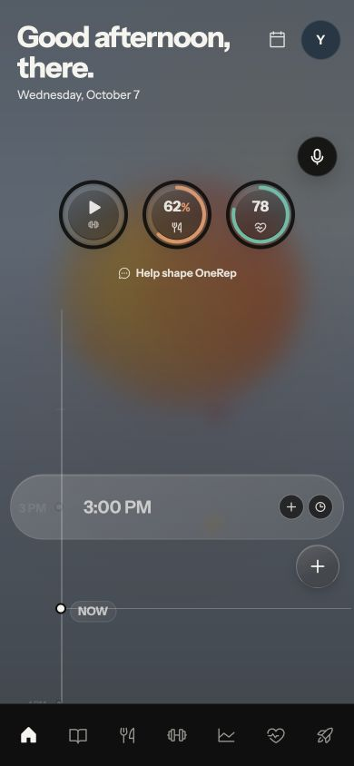
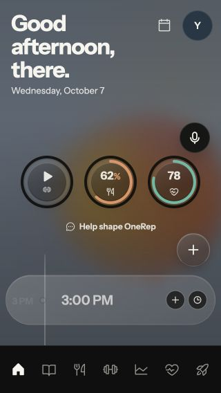
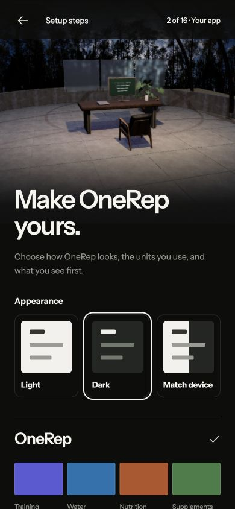
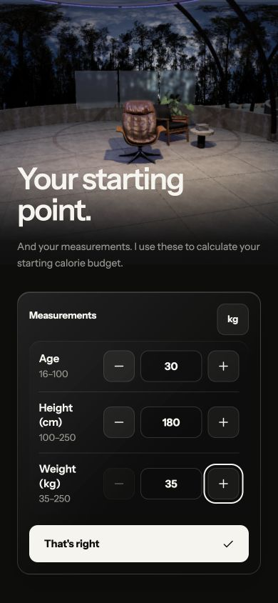
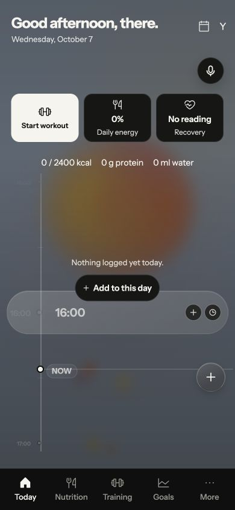

# OneRep mobile UX audit

7 October 2026

OneRep has useful interaction foundations, particularly in active workout logging, but the daily overview does not yet reliably communicate what its numbers mean or whether changes have been saved. Fix misleading readings, persistence, recovery and keyboard access before investing in further visual polish. Then simplify the first session and make the main mobile destinations easier to recognize.

The user tasks assumed for this review are starting a workout, logging food or water, correcting a past entry, understanding the day and reviewing progress. These follow the implemented product flows; they are not findings from interviews or analytics.

## Scope and evidence

The review covered `apps/mobile`, its shared UI primitives and the iOS navigation implementation. Browser walkthroughs used 390 × 844, 320 × 568 and 1440 × 1000 viewports. Sign-in was viewed in the actual app. Onboarding and active workout interactions used existing isolated fixtures. Today, Nutrition, Journal, Health and Goals were rendered from their actual components through a temporary fixture with an in-memory backend, empty sample histories and no authenticated account. That temporary fixture was removed after review. Settings and food search recovery were reviewed in source.

Verified interactions included onboarding progression, measurement entry and blur, opening quick add, completing and undoing availability for workout sets, finishing early, keyboard navigation through a collapsed nutrition editor and a rejected goal save. No account, production logs or app implementation were changed.

Native behavior is source evidence, not a device walkthrough. Full VoiceOver and TalkBack behavior, permissions, keyboard overlays, populated production accounts, network timing, contrast ratios and performance on physical devices remain unverified. This is a heuristic audit with targeted interaction checks, not a user study or a WCAG certification. The screenshots show fixture data and app components without the full production route shell.

P1 means fix promptly because the issue compromises trust, persistence, recovery or access. P2 means address in the next UX iteration. These priorities are judgments about likely impact, not measured incidence.

## Priority overview

| ID | Priority | Finding | Evidence |
| --- | --- | --- | --- |
| 01 | P1 | Today presents fixed values as personal readings | Rendered and source |
| 02 | P1 | Timeline time changes never persist | Source |
| 03 | P1 | Timeline deletion has no undo or failure recovery | Source |
| 04 | P1 | Collapsed daily goals retain invisible keyboard controls | Reproduced |
| 05 | P1 | Failed daily goal saves close the editor without feedback | Reproduced |
| 06 | P2 | Measurement validation silently changes the entered number | Reproduced |
| 07 | P2 | Onboarding requires too many early decisions | Rendered and source |
| 08 | P2 | Mobile navigation hides seven destination labels | Rendered and source |
| 09 | P2 | Today gives a new user little orientation or daily summary | Rendered and source |
| 10 | P2 | Routine actions depend on discovering hold gestures | Rendered and source |
| 11 | P2 | Timeline Edit drops the entry and date context | Source |
| 12 | P2 | Today mixes a frozen date with a live device clock | Source |
| 13 | P2 | Goals interrupts first viewing with a preselected focus | Rendered and source |
| 14 | P2 | Nutrition treats unresolved data as zero intake and default goals | Source |

## Findings and proposed fixes

### 01 Today presents fixed values as personal readings

[App.tsx](/Users/ananth/Documents/Code/onerep/apps/mobile/src/App.tsx:268) passes `nutritionPercent: 62` and `recoveryScore: 78` directly into the dashboard dials. The empty-history fixture consequently displays Fuel at 62% and Ready at 78 while Health says it has nothing to read. These are not labeled as examples. A user can reasonably interpret them as derived from their own logs.

Replace the constants with defined calculations and actual data. Explain the metric, denominator and relevant date in visible language. Use an explicit unavailable state when there is insufficient data. The dial component currently converts null to zero, so fixing only the caller would still conflate missing data with a measured zero. This follows visibility of system status and the need to match the user's understanding of a reading.

Acceptance: empty, pending, partially logged and fully logged days show distinct truthful states. Past dates show their own readings. Health and Today agree about whether a recovery reading exists.

### 02 Timeline time changes never persist

[App.tsx](/Users/ananth/Documents/Code/onerep/apps/mobile/src/App.tsx:435) handles `onEntryTimeChange` by updating `timelineOverrides` in React state. [Timeline pointer handling](/Users/ananth/Documents/Code/onerep/apps/mobile/src/dashboard/timeline.tsx:413) changes the displayed minute while dragging, but there is no commit mutation. Navigating away or reloading removes the apparent correction. The visual feedback promises an edit that the data does not contain.

Persist the owning entry's timestamp once the edit is committed, with pending, saved and failure states. Keep the previous value available for undo or rollback. Provide a labeled time field or picker alongside dragging. The current drag handle is a pointer-only `span`, so it also needs an equivalent accessible operation. WCAG's dragging criterion requires a non-drag pointer alternative; keyboard support is a separate requirement. See [W3C dragging movements](https://www.w3.org/WAI/WCAG22/Understanding/dragging-movements.html).

Acceptance: changing an entry's time survives reload and another client reading the entry. Rejected saves explain what happened. The same correction is possible without dragging.

### 03 Timeline deletion has no undo or failure recovery

[handleDeleteTimelineEntry](/Users/ananth/Documents/Code/onerep/apps/mobile/src/App.tsx:210) fires the owning delete mutation directly with `void`, without confirmation, undo, pending feedback or a rejection handler. The controls place Delete beside Edit and Add in [28 px targets](/Users/ananth/Documents/Code/onerep/apps/mobile/src/dashboard/timeline.tsx:1066). This makes an accidental tap costly and a failed request ambiguous.

Use a recoverable removal followed by an Undo action when feasible. Otherwise use a proportionate confirmation that identifies the entry and date. Handle rejection with a clear retry path, and prevent repeated requests while pending. Increase the effective touch area and visually distinguish the destructive action from adjacent routine actions. The 28 px size is a mobile ergonomics concern, not an automatic WCAG target-size violation: WCAG AA's minimum is 24 CSS px with defined exceptions. See [W3C target size](https://www.w3.org/WAI/WCAG22/Understanding/target-size-minimum.html).

Acceptance: a mistaken deletion can be recovered or prevented, and an unsuccessful deletion never leaves the user guessing.

### 04 Collapsed daily goals retain invisible keyboard controls

[GoalsCardWrapper](/Users/ananth/Documents/Code/onerep/apps/mobile/src/pages/Nutrition.tsx:1047) collapses its contents using a zero-height grid and opacity. It leaves the controls mounted and focusable. With Daily goals reporting `aria-expanded="false"`, pressing Tab from its disclosure button focused the invisible Decrease calories goal button. The accessibility tree also exposed all four fields, Save and Reset.

Remove collapsed controls from keyboard navigation and the accessibility tree using conditional rendering, `hidden` or an appropriate `inert` transition strategy. Connect the disclosure button to its controlled region. Restore focus to the disclosure if a save closes the editor. The observed invisible focus conflicts with [W3C focus visibility](https://www.w3.org/WAI/WCAG22/Understanding/focus-visible.html).

Acceptance: Tab skips every collapsed control. Opening the disclosure exposes a predictable sequence, and closing it leaves focus visible.

### 05 Failed daily goal saves close the editor without feedback

The [Save and Reset handlers](/Users/ananth/Documents/Code/onerep/apps/mobile/src/pages/Nutrition.tsx:1117) call `void onSave(...)` and immediately set `editing` to false. The supplied [onSave callback](/Users/ananth/Documents/Code/onerep/apps/mobile/src/pages/Nutrition.tsx:4130) awaits the mutation but does not catch failures. A deliberately rejected fixture mutation closed the editor, exposed no user-facing error and produced an unhandled rejection. Focus remained on the now-invisible Save button.

Await the result inside the editor, disable duplicate submission and show a saving state. Keep the editor and draft open on failure with a useful inline error. Close only after the mutation succeeds or the offline queue explicitly accepts the change, with copy distinguishing local queuing from server sync. This addresses system status and error recovery.

Acceptance: a rejected save preserves the draft, announces the error and offers retry. Success returns focus visibly and updates the displayed targets.

### 06 Measurement validation silently changes the entered number

[NumberQuestion](/Users/ananth/Documents/Code/onerep/packages/ui/src/components/onboarding-controls.tsx:48) clamps the entered value on blur. In onboarding, entering `30` kg and tabbing away changed it to `35` kg with no error or explanation. The initial production profile also supplies age 25, height 170 cm and weight 75 kg before the user has entered their own measurements, with a button labeled That's right.

Preserve the typed value and explain the supported range. Let the person correct or explicitly accept a suggested value. Distinguish an initial suggestion from a confirmed personal measurement, and avoid silently submitting seeded values. Display the relevant unit and associate the message with the input. See [W3C form validation](https://www.w3.org/WAI/tutorials/forms/validation/).

Acceptance: out-of-range, blank and invalid values remain understandable and recoverable. The saved measurement is the number the person knowingly confirmed.

### 07 Onboarding requires too many early decisions

The [stage list](/Users/ananth/Documents/Code/onerep/apps/mobile/src/pages/OnboardingMobile.tsx:406) has 16 steps. Step 2 asks for appearance, six visual identities, weight units, energy units, training focus, simplified dashboard and the destination after setup. Goals come afterward. Connections, import and optional Coach setup also occur before finishing. The phone walkthrough required scrolling through substantial customization before reaching Continue.

Define a short route to the first useful action. Ask only for information required by that chosen action, preserving necessary consent and safety checks before their dependent features. Defer visual identity, extra preferences, integrations, imports and optional Coach configuration to contextual prompts or Settings. Keep the existing draft persistence, step counter and review capability. Hick's Law supports reducing simultaneous decisions, but splitting everything into more mandatory steps can still increase total effort. [NN/g progressive disclosure](https://www.nngroup.com/articles/progressive-disclosure/) is the more practical guide here.

Acceptance: a new user can log something or begin a workout without first customizing appearance or configuring integrations. Optional setup is clearly optional and can be resumed.

### 08 Mobile navigation hides seven destination labels

[BASE_TABS](/Users/ananth/Documents/Code/onerep/apps/mobile/src/components/bottom-bar.tsx:82) contains Today, Journal, Nutrition, Training, Goals, Health and Coach. [AppNavigationChrome](/Users/ananth/Documents/Code/onerep/packages/ui/src/components/app-navigation.tsx:59) renders their icons without visible labels on phones. Accessible labels exist, but sighted users must learn the book, chart, heart and rocket meanings. Today and Journal both offer quick logging; Goals also contains progress and the exercise library, which makes the unlabeled icons harder to predict.

Use stable visible labels and test a smaller set of primary destinations based on actual user tasks. Four or five labeled destinations is a candidate design, not a universal rule. Group secondary tools only after a navigation exercise confirms where people expect them. The iOS source additionally implements a collapsed navigation button that expands the destinations; evaluate the extra interaction and recognition cost on a device before treating it as equivalent to the web bar.

Acceptance: first-time users can find food logging, training, progress, journaling and Coach without guessing or memorizing icons. Preserve consistent names and selection cues across web and native.

### 09 Today gives a new user little orientation or daily summary

The empty Today view contains a greeting, three icon dials, a feedback invitation and a mostly empty time ruler. [The empty-state message](/Users/ananth/Documents/Code/onerep/apps/mobile/src/dashboard/timeline.tsx:443) appears only for past days. [The numeric DayRail](/Users/ananth/Documents/Code/onerep/apps/mobile/src/App.tsx:372) is hidden on phones, so daily food and water totals are absent from this overview. On the 320 × 568 fixture, the large greeting and supporting controls leave little space for the main timeline. The outer layout uses a fixed viewport height and hides overflow.

For a first day, state that nothing is logged and provide a prominent labeled first action. For returning users, expose a compact daily summary grounded in their chosen tracking mode. Make feedback secondary. Reduce the header on short screens or allow the outer page to scroll so content competes less with the timeline. Give the time ruler an optional list presentation if task testing shows scanning and corrections are difficult.

Acceptance: a person can answer what is logged, what remains relevant to their plan and how to add the next entry at both phone sizes. Large text and long names do not trap content inside a shrinking timeline.

### 10 Routine actions depend on discovering hold gestures

[HoldToStartDial](/Users/ananth/Documents/Code/onerep/apps/mobile/src/components/training-hero-dials.tsx:152) requires a two-second press to start an open workout. Today visually shows a play icon; the hold instruction is announced in the accessible name or revealed after a short press. [QuickAddFab](/Users/ananth/Documents/Code/onerep/apps/mobile/src/dashboard/quick-add-fab.tsx:602) opens quick actions on tap and a separate tool interface on hold. The hint is retired after use. The start dial supports held Enter and Space, but has no ordinary click handler, so assistive-technology activation needs device verification.

Give routine actions a clear tap path and a visible action label. Keep hold as an optional shortcut if it proves useful. Offer an explicit More action inside quick add for the interface currently hidden behind holding. If accidental workout starts are a concern, provide an easy cancel or lightweight confirmation rather than requiring everyone to discover a timed gesture.

Acceptance: starting a workout and reaching additional quick actions work with ordinary activation, including VoiceOver, TalkBack and keyboard use. No essential action depends on remembering a disappearing hint.

### 11 Timeline Edit drops the entry and date context

[The edit handler](/Users/ananth/Documents/Code/onerep/apps/mobile/src/App.tsx:444) locates the exact food entry, but routes water, supplements and workouts to their general pages with no date or entry identifier. `/water` redirects to Nutrition. Workouts and Supplements initialize their selected day to today. Tapping Edit on an older entry therefore does not open that entry's editor and can place the user on the wrong day.

Pass the selected date and owning entry ID into a real editor, or open a sheet already scoped to that entry. Show the date and current values in the edit state. Distinguish Edit from View history if a direct editor is unavailable. This supports recognition rather than recall and preserves task continuity.

Acceptance: editing Tuesday's water, supplement or workout opens Tuesday's exact record. Returning to Today preserves the viewed day and reveals the result.

### 12 Today mixes a frozen date with a live device clock

[todayKey](/Users/ananth/Documents/Code/onerep/apps/mobile/src/App.tsx:78) is memoized only on the preferred timezone. The greeting's `now` is also memoized once. The [timeline clock](/Users/ananth/Documents/Code/onerep/apps/mobile/src/dashboard/timeline.tsx:128) refreshes using device-local hours, while queries use the saved timezone. Entry times are likewise formatted without an explicit saved timezone. An open session can continue addressing yesterday after midnight, and a device timezone differing from the diary timezone can make its NOW position inconsistent with the selected date.

Use one diary timezone and a refreshable clock for the date, greeting, NOW marker and entry formatting. Refresh on foreground return and the date boundary while retaining deliberate browsing of a historical day.

Acceptance: an open session rolls correctly into the next diary day. Changing the device timezone does not silently move entries into an inconsistent day or time position. This finding was established in source; crossing midnight was not exercised in the browser.

### 13 Goals interrupts first viewing with a preselected focus

[GoalsHubView](/Users/ananth/Documents/Code/onerep/apps/mobile/src/components/goals-hub.tsx:46) automatically opens its setup sheet when `goalsIntroducedAt` is absent. [DEFAULT_GOAL_PLAN](/Users/ananth/Documents/Code/onerep/apps/mobile/src/lib/goal-plan.ts:5) selects hypertrophy, displayed as Build muscle. The fixture opened this sheet on arrival before the user requested it. This introduces another goal decision after the 16-step onboarding, whose choices include Stay healthy.

Let people orient themselves in Goals before opening an optional setup sheet. Reuse an earlier choice when the concepts genuinely match, or explain the difference between a nutrition goal and a training focus. Start with no selected focus when the product has no basis for choosing one, and allow the user to continue tracking without adopting a specialized programme.

Acceptance: the initial goal flow does not steer an undecided person into Build muscle. Repeated setup asks have a clear purpose and a visible exit. Whether the interruption materially harms comprehension needs user testing.

### 14 Nutrition treats unresolved data as zero intake and default goals

[Nutrition.tsx](/Users/ananth/Documents/Code/onerep/apps/mobile/src/pages/Nutrition.tsx:2473) converts unresolved food queries to an empty list, while [goal fallbacks](/Users/ananth/Documents/Code/onerep/apps/mobile/src/pages/Nutrition.tsx:2540) provide 2,000 kcal and default macros. The rendered totals and Nothing logged yet state do not wait for these inputs to resolve. A slow initial subscription can consequently resemble a real empty diary with apparently personalized targets. Safety-dependent metric visibility also defaults while the nutrition plan is unresolved.

Represent loading, confirmed emptiness, unavailable data and cached data separately. Avoid showing a remaining calorie budget until the governing plan and intake are known. Resolve visibility preferences before exposing their dependent metrics. Provide a retry or sync status where appropriate.

Acceptance: delayed subscriptions do not display fabricated zero intake, guessed targets or prematurely visible metrics as settled facts. This is source evidence; real network latency was not measured.

## Patterns worth preserving

- Sign-in has field labels, password visibility, reset access and a 20-second action timeout with recovery copy.
- Onboarding saves a draft, exposes its current step, restores focus to the step heading and supports revisiting completed answers.
- Active workout logging gives the current set a clear primary action, supports undo for completed sets and explains that finishing early saves only completed sets and logged cardio.
- Shared sheets implement keyboard focus containment, Escape dismissal, opener focus restoration and visual-viewport adjustment. Full assistive-technology behavior still needs device verification.
- Food search supports recent and repeat foods, a retry path, creating a custom food after no results and Undo after logging.
- The offline infrastructure distinguishes queuing and synchronization. Extend this clarity to dashboard actions and goal editing.
- Health correctly explains the absence of readings. Its empty-state honesty should carry through to Today.

## Design principles used

The supplied laws are useful lenses, not quotas or guarantees. Jakob's Law informs familiar labels and predictable actions. Hick's Law informs early decision load. Fitts's Law informs reachable touch targets. Miller's Law supports chunking and retaining context, but does not establish a seven-item navigation limit; [NN/g distinguishes working memory from short-term memory](https://www.nngroup.com/articles/working-memory-external-memory/). Von Restorff supports making the current primary action distinctive. Zeigarnik suggests useful completion cues, but does not justify unnecessary mandatory setup. The aesthetic-usability effect should complement truthful states and readable content.

Additional guidance comes from [NN/g's usability heuristics](https://www.nngroup.com/articles/ten-usability-heuristics/), especially system status, user control, error prevention, consistency and recognition rather than recall; [progressive disclosure](https://www.nngroup.com/articles/progressive-disclosure/); and the W3C accessibility guidance cited with relevant findings. The design proposals and priorities above are this audit's judgments, not claims that those sources evaluated OneRep.

## Implementation order and validation

1. Repair the five P1 issues. Verify durable edits, failure feedback, undo or confirmation, truthful readings and visible keyboard focus.
2. Resolve input validation, date continuity and pending-data states. Exercise a rejected request, offline queuing, reload, foreground return and an old entry edit.
3. Prototype labeled navigation and a shorter route to the first useful action. Retain necessary consent and safety checks where their dependent features begin.
4. Test realistic tasks with first-time and returning users: log breakfast, add water, start a workout, correct yesterday's entry and explain today's readings. Observe wrong destinations, missed controls and recovery attempts.
5. Verify 320 px layouts, large text, both themes, actual contrast over animated backgrounds, reduced motion, native permissions and assistive-technology activation on devices.

Use time to the first successful log, completion accuracy, wrong-day edits, navigation mistakes and successful recovery as outcome measures. No new analytics were added, and this audit sets no numerical improvement targets without a baseline.

## Visual evidence

Empty-history Today at 390 × 844, showing the fixed readings and icon-only primary navigation:

Today at 320 × 568, showing how the header competes with timeline space:

Onboarding preferences at step 2 of 16, before the goal question:

Measurement field after entering 30 kg and moving focus, now showing 35 kg without an explanation:

## Implementation and verification, 7 October 2026

All 14 findings have been addressed in the working tree. The audit above records the original behavior; its source line numbers describe the pre-change snapshot. Implementation changes are summarized below.

| ID | Implemented change | Verification |
| --- | --- | --- |
| 01 | Today calculates daily energy from food and supplement nutrients against the selected day's effective target. Recovery uses the actual health status. Labels, zero, loading and unavailable states replace the fixed readings. Tracking preferences suppress hidden readings. | UI state tests; empty and populated browser fixtures; selected-day query review. |
| 02 | Removed the unsaved time-drag interaction. A labeled time field saves the owning food, water, supplement or workout record through scoped mutations. | Correction survives browser reload; backend persistence and ownership tests; failure and duplicate-submit tests. |
| 03 | Delete opens a confirmation naming the entry and date. Pending requests disable repeat actions. Failure keeps the entry and offers retry. Timeline action targets are 44 px. | Browser confirmation, rejected deletion and cancellation; shared entry-sheet pending and failure tests. |
| 04 | Collapsed daily goal controls are hidden and inert. The disclosure identifies its region. Successful saves restore focus. | Browser Tab skips the collapsed fields and reaches the next visible control. |
| 05 | Goal saves and resets await completion, preserve drafts on failure, prevent duplicate requests and announce retry. Offline acceptance is distinguished from server saving. | Browser rejected save, retained draft, successful retry and focus return; existing offline queue behavior retained. |
| 06 | Measurement inputs retain invalid text and show linked range errors. New measurements start blank and require deliberate confirmation. Old unconfirmed drafts cannot silently finish setup. | DOM tests for blank, invalid, blur and correction; browser 30 kg remains 30 with an error and disabled confirmation. |
| 07 | Core onboarding has eight steps, with goals first after Welcome. Appearance, imports, connections and Coach configuration are deferred. Consent, safety, draft persistence and review remain. | Browser progress and review; final save rejects missing consent and succeeds in the isolated fixture after consent. |
| 08 | Mobile navigation has five labeled destinations: Today, Nutrition, Training, Goals and More. More lists Journal, Health, Coach and Settings. Native navigation uses the same destinations and remains expanded. Desktop retains its labeled sidebar. | Browser labels and More route; navigation contract tests; Android and iOS compilation. |
| 09 | Today includes compact daily totals, a clear empty state and Add to this day. Smaller headers and page scrolling preserve room for the timeline. | Rendered at 320 × 568, 390 × 844 and 1440 × 1000; no horizontal overflow. |
| 10 | Workout and endurance starts are ordinary labeled buttons. Quick add exposes More actions as a menu item; holding remains an optional shortcut. The menu can scroll on short screens. | DOM click test; browser Enter starts the workout route and a menu click opens Quick actions. |
| 11 | Corrections capture the selected record, date and timezone. Food details open the selected food entry. Workout details open the exact session when available. Water, supplement and workout corrections retain their record identity. | Backend tests scope historical corrections to owner, day and record; browser water amount/time correction survives reload. |
| 12 | Today and Nutrition use a refreshing diary clock in the configured timezone. Dates roll over at midnight, explicit past selections remain stable, and timeline labels use canonical 24-hour time. Corrections convert the selected diary date/time with DST validation. | Unit tests for midnight, different device/diary zones, historical summer/winter dates and nonexistent DST times; browser Berlin 10:30 saves as 08:30 UTC. |
| 13 | Goals setup opens only on request. New setup has no selected focus and Save stays disabled until a choice. Copy explains that training focus is optional and separate from nutrition goals. | Browser first view, unselected form and deliberate save; DOM regression test for the same path. |
| 14 | Nutrition waits for preferences, plan, goals, food, water and supplement data. Pending data shows a loading status. A missing plan shows a recovery action. Health write-back waits for food resolution. | Browser pending and unavailable fixtures expose no fabricated settled totals; mobile suite and type checks. |

Validation completed: the full mobile test command, five dedicated UX interaction tests, the scoped Convex correction/supplement/goal tests, mobile and shared UI TypeScript checks, and all six translation catalogs. Targeted ESLint reports no errors and seven existing warnings. Android Kotlin compilation and the iOS arm64 simulator build succeed.

The mobile test command passed 2,084 tests in total. The scoped Convex run passed 16 tests. The development-mode web bundle builds successfully. The production-mode bundle is blocked by the existing configuration guard because this checkout selects a development Convex deployment; deployment settings were not changed.

Browser checks use the real app components with an isolated fake client. Backend tests use an isolated Convex database. No production account or logs were changed, and these changes have not been deployed. Native compilation does not establish physical-device usability; VoiceOver, TalkBack, real keyboard overlays and live cross-client sync remain device or staging checks. Updated Playwright scenario files are included, but their full automated visual suite was not run.

Revised phone overview, with fixture data:

[Small phone evidence](ux-audit-mobile-2026-10-07-assets/today-fixed-small-phone.png) and [desktop evidence](ux-audit-mobile-2026-10-07-assets/today-fixed-desktop.png).
